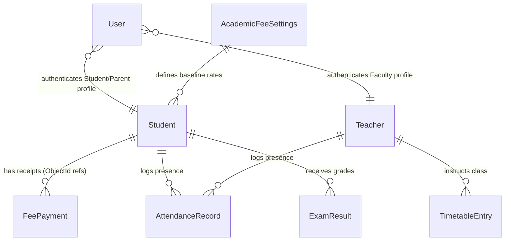

# Database Schema Design

This document details the database schema, models, validations, and entity relationships established for the Residential Junior College ERP Backend.

---

## 1. Entity Relationship Diagram (ERD)

---

## 2. Models & Collections Details

### A. Student (Collection: `students`)
Represents the primary profile of a student. Merges both the Administrative roster and the Financial accounts data.
- **Relationships**:
  - `receipts`: Array of ObjectIds referencing `FeePayment` documents.
- **Key Fields & Validations**:
  - `admissionNumber`: String (Required, Unique, e.g. `ADM24001`)
  - `studentId`: String (Required, Unique, e.g. `STU-1001`)
  - `name`: String (Required)
  - `email`: String (Required, validated using email format regex)
  - `tuitionFee`, `hostelFee`, `transportFee`, `miscellaneousFee`: Numbers (Required, validated to be `>= 0`)
  - `remainingBalance`, `totalPaid`: Numbers (Required, validated to be `>= 0`)

### B. Teacher (Collection: `teachers`)
Represents faculty profiles.
- **Key Fields & Validations**:
  - `id`: String (Required, Unique, e.g. `FAC-201`)
  - `name`: String (Required)
  - `salary`: Number (Required, validated `>= 0`)
  - `status`: String (Enum: `Active`, `Inactive`)

### C. Bulletin (Collection: `bulletins`)
Represents public updates, circulars, and notices.
- **Key Fields**:
  - `id`: String (e.g. `BUL-001`)
  - `category`: String (Enum: `announcement`, `gallery`, `event`, `circular`, `notice`, `holiday`)
  - `title`: String (Required)
  - `content`: String (Required)

### D. AttendanceRecord (Collection: `attendancerecords`)
Captures single daily logs of attendance for students or faculty dynamically.
- **Relationships**:
  - `targetId`: Dynamic ObjectId referencing `Student` or `Teacher` profile.
  - `targetModel`: String (Enum: `Student`, `Teacher`) to facilitate Mongoose `refPath` resolution.
- **Key Fields**:
  - `date`: Date (Required, defaults to `Date.now`)
  - `status`: String (Enum: `present`, `absent`, `late`, `leave`)

### E. FeePayment (Collection: `feepayments`)
Represents single transaction receipts printed or logged by accountants.
- **Relationships**:
  - `student`: ObjectId referencing `Student` (Required).
- **Key Fields & Validations**:
  - `receiptNumber`: String (Required, Unique, e.g. `REC-2026-001`)
  - `amount`: Number (Required, `>= 0`)
  - `balance`: Number (Required, `>= 0` - reflects balance after receipt payment)

### F. AcademicFeeSettings (Collection: `academicfeesettings`)
Holds global baseline lockable rates and institutional billing rules (singleton document).
- **Key Fields**:
  - `tuition`, `hostel`, `transport`, `misc`: Numbers (Required, `>= 0`)
  - `isLocked`: Boolean (Required, lock status for academic year)
  - `academicYear`, `installments`, `lateFeeRules`, `scholarshipRules`, `discountRules`: Strings

### G. ExamResult (Collection: `examresults`)
Grades sheet record.
- **Relationships**:
  - `student`: ObjectId referencing `Student` (Required).
- **Key Fields**:
  - `subject`, `testTitle`, `date`, `score`: Strings (Required)

### H. TimetableEntry (Collection: `timetableentries`)
Class hourly calendar slot.
- **Relationships**:
  - `teacher`: ObjectId referencing `Teacher` (Required).
- **Key Fields**:
  - `section`, `day`, `period`, `subject`: Strings (Required)

### I. User (Collection: `users`)
Client credentials mapping roles to profiles.
- **Relationships**:
  - `profileId`: Optional ObjectId pointing to profile.
  - `profileModel`: String (Enum: `Student`, `Teacher`).
- **Key Fields**:
  - `username`: String (Required, Unique, lowercase)
  - `passwordHash`: String (Required)
  - `role`: String (Enum: `student`, `parent`, `accountant`, `faculty`, `admin`)
